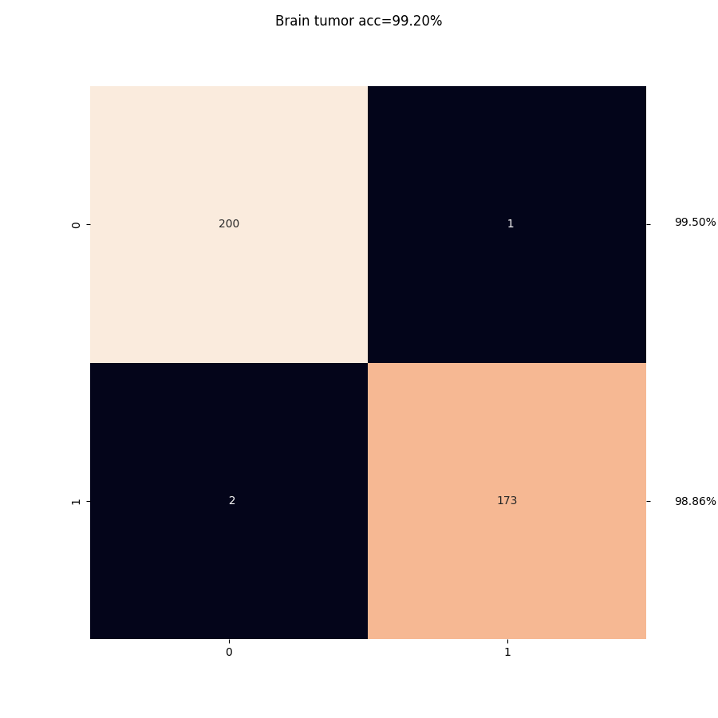
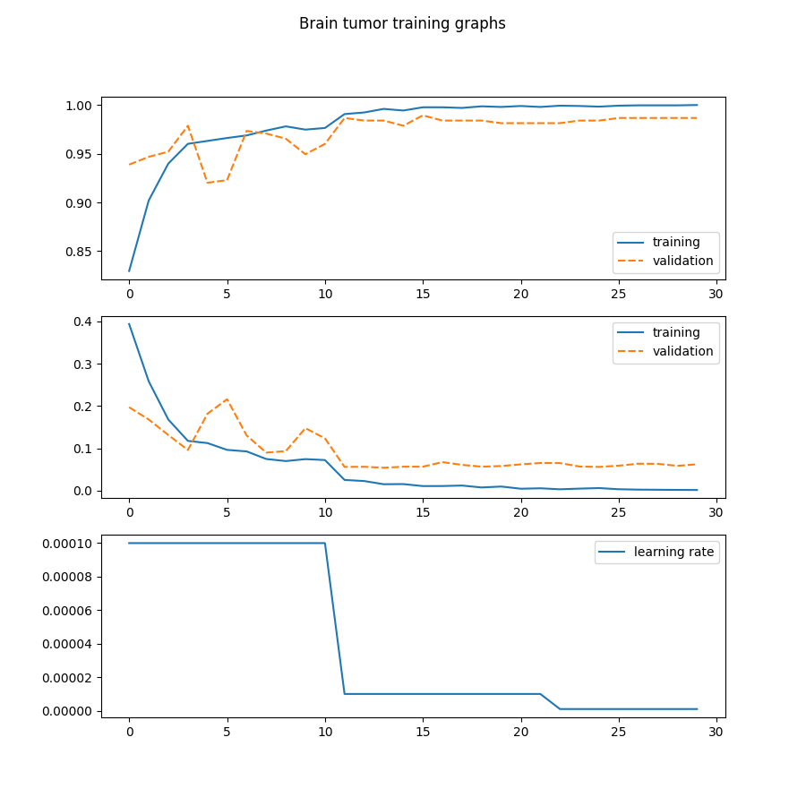

# kaggle-torch

Project contains some solutions to kaggle medical image datasets. These solutions
are provided mainly as examples. I personally dislike jupynter notebooks, so
all scripts are implemented as terminal programs.

## Installation

Create virtual environment and install. I expect 3.11.

```
python -m venv .venv
source .venv/bin/activate
pip install -r requirements.txt
```

## Brain tumor

Run as module

```
python -m scripts.brain_tumor -lr 1e-4 \
    -bs 4 -e 1000 -d cuda:0 -p 30 \
    -m resnet34 --dataset-root assets/Brain\ Tumor \
    --outfolder runs/brain_tumor
```

This should produce a test accuracy of 99.20% or similar
and a test confusion matrix similar to



with training graphs




View script options with

```
python -m scripts.brain_tumor --help
```

## Authors

- [vahvero](https://github.com/vahvero)

This work is licenced with a MIT licence